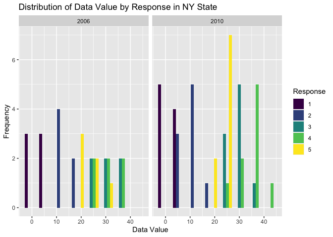

p8105_hw3_jer2243
================
Juliet Rowe
2023-10-09

# Problem 2

## Load packages and BRFSS data

``` r
library(tidyverse)
```

    ## ── Attaching core tidyverse packages ──────────────────────── tidyverse 2.0.0 ──
    ## ✔ dplyr     1.1.2     ✔ readr     2.1.4
    ## ✔ forcats   1.0.0     ✔ stringr   1.5.0
    ## ✔ ggplot2   3.4.2     ✔ tibble    3.2.1
    ## ✔ lubridate 1.9.2     ✔ tidyr     1.3.0
    ## ✔ purrr     1.0.1     
    ## ── Conflicts ────────────────────────────────────────── tidyverse_conflicts() ──
    ## ✖ dplyr::filter() masks stats::filter()
    ## ✖ dplyr::lag()    masks stats::lag()
    ## ℹ Use the conflicted package (<http://conflicted.r-lib.org/>) to force all conflicts to become errors

``` r
library(dplyr)
library(ggplot2)
library(p8105.datasets)
data("brfss_smart2010")
```

## Clean BRFSS data

``` r
levels <- c("Poor", "Fair", "Good", "Very good", "Excellent")
values <- c(1, 2, 3, 4, 5)

brfss_smart2010_tidy = brfss_smart2010 |>
  janitor::clean_names() |>
  filter(topic == "Overall Health") |>
  transform(response = factor(response, levels = levels, labels = values, ordered = TRUE))
```

## In 2002, which states were observed at 7 or more locations? What about in 2010?

``` r
brfss_2002 <- brfss_smart2010_tidy |>
  filter(year==2002)

result <- brfss_2002 |>
  group_by(locationabbr) |>
  summarise(unique_locationdesc = n_distinct(locationdesc)) |>
  filter(unique_locationdesc >= 7)

print(result)
```

    ## # A tibble: 6 × 2
    ##   locationabbr unique_locationdesc
    ##   <chr>                      <int>
    ## 1 CT                             7
    ## 2 FL                             7
    ## 3 MA                             8
    ## 4 NC                             7
    ## 5 NJ                             8
    ## 6 PA                            10

``` r
brfss_2010 <- brfss_smart2010_tidy |>
  filter(year==2010)

result <- brfss_2010 |>
  group_by(locationabbr) |>
  summarise(unique_locationdesc = n_distinct(locationdesc)) |>
  filter(unique_locationdesc >= 7)

print(result)
```

    ## # A tibble: 14 × 2
    ##    locationabbr unique_locationdesc
    ##    <chr>                      <int>
    ##  1 CA                            12
    ##  2 CO                             7
    ##  3 FL                            41
    ##  4 MA                             9
    ##  5 MD                            12
    ##  6 NC                            12
    ##  7 NE                            10
    ##  8 NJ                            19
    ##  9 NY                             9
    ## 10 OH                             8
    ## 11 PA                             7
    ## 12 SC                             7
    ## 13 TX                            16
    ## 14 WA                            10

In 2002, 6 states were observed at 7 or more locations (CT, FL, MA, NC,
NJ, PA). In 2010, 14 states were observed at 7 or more locations (CA,
CO, FL, MA, MD, NC, NE, NJ, NY, OH, PA, SC, TX, WA).

## Construct a dataset limited to “excellent” responses

``` r
brfss_excellent = brfss_smart2010_tidy |>
  filter(response == "5") |>
  group_by(locationabbr, year) |>
  mutate(data_value_avg = mean(data_value, na.rm = TRUE)) |>
  select(year, locationabbr, data_value_avg)
```

The dataset limited to “excellent” responses consists off 2,125
observations.

## Spaghetti plot of the avg value over time within a state

``` r
ggplot(brfss_excellent, aes(x=year, y=data_value_avg, color=locationabbr, group=locationabbr)) + 
  geom_line() +
  labs(x="Year", y="Average Data Value", color = "State") +
  ggtitle("Average Data Value by State over Years")
```

<!-- -->
ADD COMMENTS HERE

## Two-panel plot

``` r
ny_data <- brfss_smart2010_tidy |>
  filter(locationabbr == "NY" & year %in% c(2006, 2010))

ggplot(ny_data, aes(x = data_value, fill = response)) +
  geom_histogram(binwidth = 6, position = "dodge") +
  facet_wrap(~ year, nrow = 1) +
  labs(x = "Data Value", y = "Frequency", fill = "Response") +
  ggtitle("Distribution of Data Value by Response in NY State")
```

<!-- -->
ADD COMMENTS HERE

# Problem 3

## Import and clean demographic and accelerometer data

``` r
demo_data = read_csv(file = "~/Desktop/p8105_hw3_jer2243/nhanes_covar.csv", skip=4) |>
  janitor::clean_names()
```

    ## Rows: 250 Columns: 5
    ## ── Column specification ────────────────────────────────────────────────────────
    ## Delimiter: ","
    ## dbl (5): SEQN, sex, age, BMI, education
    ## 
    ## ℹ Use `spec()` to retrieve the full column specification for this data.
    ## ℹ Specify the column types or set `show_col_types = FALSE` to quiet this message.

``` r
accel_data = read_csv(file = "~/Desktop/p8105_hw3_jer2243/nhanes_accel.csv") |>
  janitor::clean_names()
```

    ## Rows: 250 Columns: 1441
    ## ── Column specification ────────────────────────────────────────────────────────
    ## Delimiter: ","
    ## dbl (1441): SEQN, min1, min2, min3, min4, min5, min6, min7, min8, min9, min1...
    ## 
    ## ℹ Use `spec()` to retrieve the full column specification for this data.
    ## ℹ Specify the column types or set `show_col_types = FALSE` to quiet this message.

## Clean the demo dataset

``` r
demo_data <- subset(demo_data, age>=21)
demo_data <- demo_data[complete.cases(demo_data), ]
```

## Merge demo dataset with accel dataset

``` r
merged_data = 
  left_join(demo_data, accel_data, by = "seqn")
```

## Encode data with reasonable variable classes
