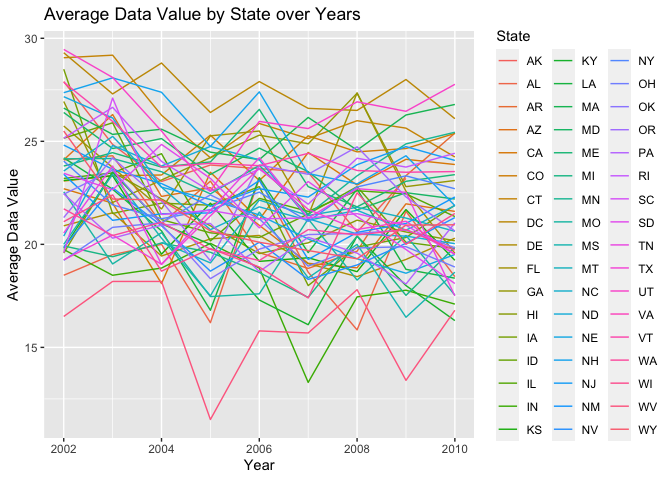

p8105_hw3_jer2243
================
Juliet Rowe
2023-10-09

# Problem 2

## Load packages and BRFSS data

``` r
library(tidyverse)
```

    ## ── Attaching core tidyverse packages ──────────────────────── tidyverse 2.0.0 ──
    ## ✔ dplyr     1.1.2     ✔ readr     2.1.4
    ## ✔ forcats   1.0.0     ✔ stringr   1.5.0
    ## ✔ ggplot2   3.4.2     ✔ tibble    3.2.1
    ## ✔ lubridate 1.9.2     ✔ tidyr     1.3.0
    ## ✔ purrr     1.0.1     
    ## ── Conflicts ────────────────────────────────────────── tidyverse_conflicts() ──
    ## ✖ dplyr::filter() masks stats::filter()
    ## ✖ dplyr::lag()    masks stats::lag()
    ## ℹ Use the conflicted package (<http://conflicted.r-lib.org/>) to force all conflicts to become errors

``` r
library(dplyr)
library(ggplot2)
library(p8105.datasets)
data("brfss_smart2010")
```

## Clean BRFSS data

``` r
levels <- c("Poor", "Fair", "Good", "Very good", "Excellent")
values <- c(1, 2, 3, 4, 5)

brfss_smart2010_tidy = brfss_smart2010 |>
  janitor::clean_names() |>
  filter(topic == "Overall Health") |>
  transform(response = factor(response, levels = levels, labels = values, ordered = TRUE))
```

## In 2002, which states were observed at 7 or more locations? What about in 2010?

``` r
brfss_2002 <- brfss_smart2010_tidy |>
  filter(year==2002)

result <- brfss_2002 |>
  group_by(locationabbr) |>
  summarise(unique_locationdesc = n_distinct(locationdesc)) |>
  filter(unique_locationdesc > 7)

print(result)
```

    ## # A tibble: 3 × 2
    ##   locationabbr unique_locationdesc
    ##   <chr>                      <int>
    ## 1 MA                             8
    ## 2 NJ                             8
    ## 3 PA                            10

``` r
brfss_2010 <- brfss_smart2010_tidy |>
  filter(year==2010)

result <- brfss_2010 |>
  group_by(locationabbr) |>
  summarise(unique_locationdesc = n_distinct(locationdesc)) |>
  filter(unique_locationdesc > 7)

print(result)
```

    ## # A tibble: 11 × 2
    ##    locationabbr unique_locationdesc
    ##    <chr>                      <int>
    ##  1 CA                            12
    ##  2 FL                            41
    ##  3 MA                             9
    ##  4 MD                            12
    ##  5 NC                            12
    ##  6 NE                            10
    ##  7 NJ                            19
    ##  8 NY                             9
    ##  9 OH                             8
    ## 10 TX                            16
    ## 11 WA                            10

3 states in 2002 were observed at 7 or more locations (MA, NJ, PA). 11
states in 2010 were observed at 7 or more locations (CA, FL, MA, MD, NC,
NE, NJ, NY, OH, TX, WA).

## Construct a dataset limited to “excellent” responses

``` r
brfss_excellent = brfss_smart2010_tidy |>
  filter(response == "5") |>
  group_by(locationabbr) |>
  mutate(data_value_avg = mean(data_value, na.rm = TRUE)) |>
  select(year, locationabbr, data_value_avg)
```

## Make a spaghetti plot of the avg value over time within a state

``` r
ggplot(brfss_excellent, aes(x=year, y=data_value_avg, color=locationabbr, group=locationabbr)) + 
  geom_line() +
  labs(x="Year", y="Average Data Value", color = "State") +
  ggtitle("Average Data Value by State over Years")
```

<!-- -->
