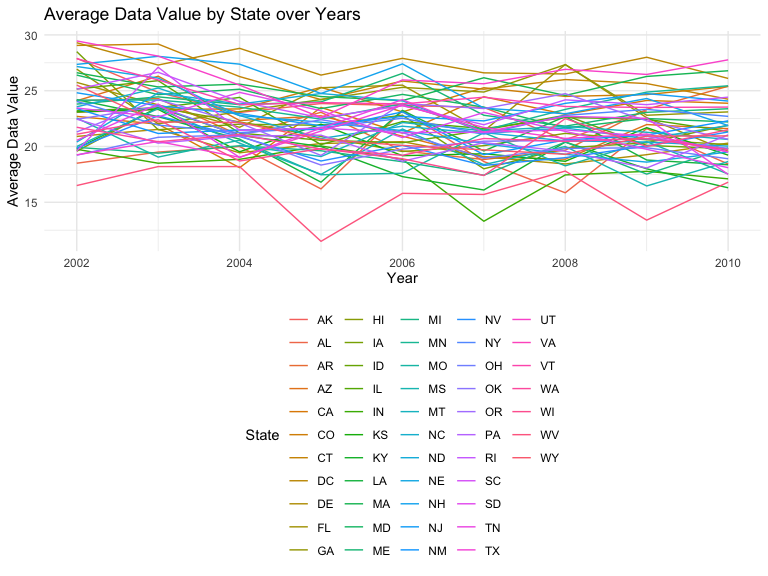
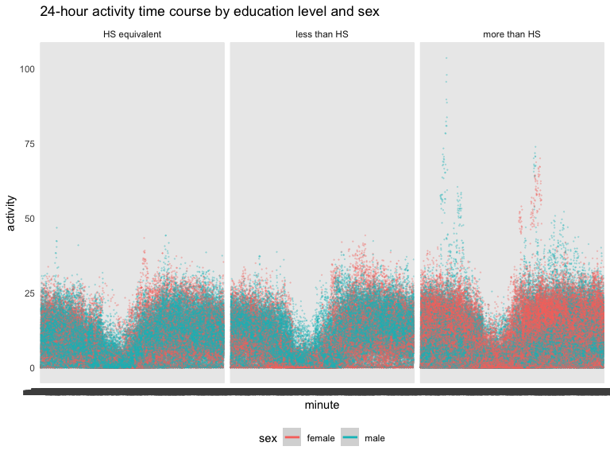
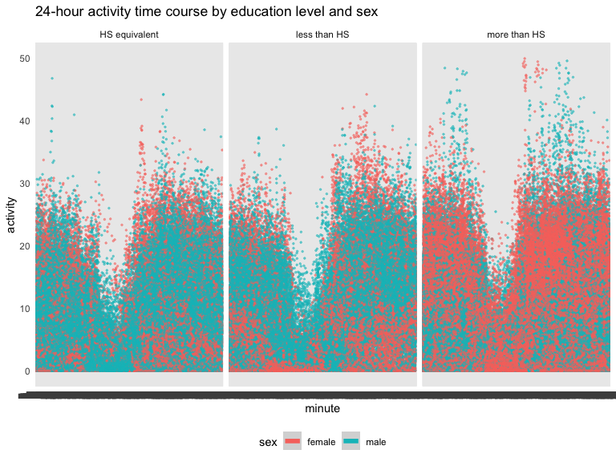

p8105_hw3_jer2243
================
Juliet Rowe
2023-10-09

# Problem 1

## Read in the data

``` r
data("instacart")

instacart = 
  instacart |> 
  as_tibble()
```

## Answer questions about the data

This dataset contains 1384617 rows and 15 columns, with each row
resprenting a single product from an instacart order. Variables include
identifiers for user, order, and product; the order in which each
product was added to the cart. There are several order-level variables,
describing the day and time of the order, and number of days since prior
order. Then there are several item-specific variables, describing the
product name (e.g. Yogurt, Avocado), department (e.g. dairy and eggs,
produce), and aisle (e.g. yogurt, fresh fruits), and whether the item
has been ordered by this user in the past. In total, there are 39123
products found in 131209 orders from 131209 distinct users.

Below is a table summarizing the number of items ordered from aisle. In
total, there are 134 aisles, with fresh vegetables and fresh fruits
holding the most items ordered by far.

``` r
instacart |> 
  count(aisle) |> 
  arrange(desc(n))
```

    ## # A tibble: 134 × 2
    ##    aisle                              n
    ##    <chr>                          <int>
    ##  1 fresh vegetables              150609
    ##  2 fresh fruits                  150473
    ##  3 packaged vegetables fruits     78493
    ##  4 yogurt                         55240
    ##  5 packaged cheese                41699
    ##  6 water seltzer sparkling water  36617
    ##  7 milk                           32644
    ##  8 chips pretzels                 31269
    ##  9 soy lactosefree                26240
    ## 10 bread                          23635
    ## # ℹ 124 more rows

Next is a plot that shows the number of items ordered in each aisle.
Here, aisles are ordered by ascending number of items.

``` r
instacart |> 
  count(aisle) |> 
  filter(n > 10000) |> 
  mutate(aisle = fct_reorder(aisle, n)) |> 
  ggplot(aes(x = aisle, y = n)) + 
  geom_point() + 
  labs(title = "Number of items ordered in each aisle") +
  theme(axis.text.x = element_text(angle = 60, hjust = 1))
```


Our next table shows the three most popular items in aisles
`baking ingredients`, `dog food care`, and `packaged vegetables fruits`,
and includes the number of times each item is ordered in your table.

``` r
instacart |> 
  filter(aisle %in% c("baking ingredients", "dog food care", "packaged vegetables fruits")) |>
  group_by(aisle) |> 
  count(product_name) |> 
  mutate(rank = min_rank(desc(n))) |> 
  filter(rank < 4) |> 
  arrange(desc(n)) |>
  knitr::kable()
```

| aisle                      | product_name                                  |    n | rank |
|:---------------------------|:----------------------------------------------|-----:|-----:|
| packaged vegetables fruits | Organic Baby Spinach                          | 9784 |    1 |
| packaged vegetables fruits | Organic Raspberries                           | 5546 |    2 |
| packaged vegetables fruits | Organic Blueberries                           | 4966 |    3 |
| baking ingredients         | Light Brown Sugar                             |  499 |    1 |
| baking ingredients         | Pure Baking Soda                              |  387 |    2 |
| baking ingredients         | Cane Sugar                                    |  336 |    3 |
| dog food care              | Snack Sticks Chicken & Rice Recipe Dog Treats |   30 |    1 |
| dog food care              | Organix Chicken & Brown Rice Recipe           |   28 |    2 |
| dog food care              | Small Dog Biscuits                            |   26 |    3 |

Finally is a table showing the mean hour of the day at which Pink Lady
Apples and Coffee Ice Cream are ordered on each day of the week. This
table has been formatted in an untidy manner for human readers. Pink
Lady Apples are generally purchased slightly earlier in the day than
Coffee Ice Cream, with the exception of day 5.

``` r
instacart |>
  filter(product_name %in% c("Pink Lady Apples", "Coffee Ice Cream")) |>
  group_by(product_name, order_dow) |>
  summarize(mean_hour = mean(order_hour_of_day)) |>
  pivot_wider(
    names_from = order_dow, 
    values_from = mean_hour) |>
  knitr::kable(digits = 2)
```

    ## `summarise()` has grouped output by 'product_name'. You can override using the
    ## `.groups` argument.

| product_name     |     0 |     1 |     2 |     3 |     4 |     5 |     6 |
|:-----------------|------:|------:|------:|------:|------:|------:|------:|
| Coffee Ice Cream | 13.77 | 14.32 | 15.38 | 15.32 | 15.22 | 12.26 | 13.83 |
| Pink Lady Apples | 13.44 | 11.36 | 11.70 | 14.25 | 11.55 | 12.78 | 11.94 |

# Problem 2

## Load packages and BRFSS data

``` r
library(tidyverse)
library(dplyr)
library(ggplot2)
library(p8105.datasets)
data("brfss_smart2010")
```

## Clean BRFSS data

``` r
levels <- c("Poor", "Fair", "Good", "Very good", "Excellent")
values <- c(1, 2, 3, 4, 5)

brfss_smart2010_tidy = brfss_smart2010 |>
  janitor::clean_names() |>
  filter(topic == "Overall Health") |>
  transform(response = factor(response, levels = levels, labels = values, ordered = TRUE))
```

This dataset contains 10625 rows and 23 columns.

## In 2002, which states were observed at 7 or more locations? What about in 2010?

``` r
brfss_2002 <- brfss_smart2010_tidy |>
  filter(year==2002)

result1 <- brfss_2002 |>
  group_by(locationabbr) |>
  summarise(unique_locationdesc = n_distinct(locationdesc)) |>
  filter(unique_locationdesc >= 7)

print(result1)
```

    ## # A tibble: 6 × 2
    ##   locationabbr unique_locationdesc
    ##   <chr>                      <int>
    ## 1 CT                             7
    ## 2 FL                             7
    ## 3 MA                             8
    ## 4 NC                             7
    ## 5 NJ                             8
    ## 6 PA                            10

``` r
brfss_2010 <- brfss_smart2010_tidy |>
  filter(year==2010)

result2 <- brfss_2010 |>
  group_by(locationabbr) |>
  summarise(unique_locationdesc = n_distinct(locationdesc)) |>
  filter(unique_locationdesc >= 7)

print(result2)
```

    ## # A tibble: 14 × 2
    ##    locationabbr unique_locationdesc
    ##    <chr>                      <int>
    ##  1 CA                            12
    ##  2 CO                             7
    ##  3 FL                            41
    ##  4 MA                             9
    ##  5 MD                            12
    ##  6 NC                            12
    ##  7 NE                            10
    ##  8 NJ                            19
    ##  9 NY                             9
    ## 10 OH                             8
    ## 11 PA                             7
    ## 12 SC                             7
    ## 13 TX                            16
    ## 14 WA                            10

In 2002, 6 states were observed at 7 or more locations. These included
CT, FL, MA, NC, NJ, PA. In 2010, 14 states were observed at 7 or more
locations. These included CA, CO, FL, MA, MD, NC, NE, NJ, NY, OH, PA,
SC, TX, WA.

## Construct a dataset limited to “excellent” responses

``` r
brfss_excellent = brfss_smart2010_tidy |>
  filter(response == "5") |>
  group_by(locationabbr, year) |>
  mutate(data_value_avg = mean(data_value, na.rm = TRUE)) |>
  select(year, locationabbr, data_value_avg)
```

The dataset limited to “excellent” responses consists of 2125
observations.

## Spaghetti plot of the avg value over time within a state

``` r
ggplot(brfss_excellent, aes(x=year, y=data_value_avg, color=locationabbr, group=locationabbr)) + 
  geom_line() +
  labs(x="Year", y="Average Data Value", color = "State") +
  ggtitle("Average Data Value by State over Years")
```


In general, the average data value has fluctuated over the years but
appears to have decreased slightly overall. Most average data values
fall between 17.5 and 27.5, with a few outliers on either end.

## Two-panel plot

``` r
ny_data <- brfss_smart2010_tidy |>
  filter(locationabbr == "NY" & year %in% c(2006, 2010)) |>
  separate(locationdesc, into =c("state", "county"), sep=5) |>
  select(-state) |>
  group_by(county)

ggplot(ny_data, aes(x = data_value, y = response)) +
  geom_point(aes(color=county)) +
  facet_grid(.~year) +
  ggtitle("Distribution of Data Value by Response in NY State")
```


‘Data value’ values were the highest for the responses “good” and “very
good”. Overall, data_value increased from 2006 to 2010, and the range of
scores per response category also widened.

# Problem 3

## Import and clean demographic and accelerometer data

``` r
demo_data = read_csv(file = "~/Desktop/p8105_hw3_jer2243/nhanes_covar.csv", skip=4) |>
  janitor::clean_names()
```

    ## Rows: 250 Columns: 5
    ## ── Column specification ────────────────────────────────────────────────────────
    ## Delimiter: ","
    ## dbl (5): SEQN, sex, age, BMI, education
    ## 
    ## ℹ Use `spec()` to retrieve the full column specification for this data.
    ## ℹ Specify the column types or set `show_col_types = FALSE` to quiet this message.

``` r
accel_data = read_csv(file = "~/Desktop/p8105_hw3_jer2243/nhanes_accel.csv") |>
  janitor::clean_names()
```

    ## Rows: 250 Columns: 1441
    ## ── Column specification ────────────────────────────────────────────────────────
    ## Delimiter: ","
    ## dbl (1441): SEQN, min1, min2, min3, min4, min5, min6, min7, min8, min9, min1...
    ## 
    ## ℹ Use `spec()` to retrieve the full column specification for this data.
    ## ℹ Specify the column types or set `show_col_types = FALSE` to quiet this message.

## Clean the demo dataset

``` r
demo_data <- subset(demo_data, age>=21)
demo_data <- demo_data[complete.cases(demo_data), ]
```

## Merge demo dataset with accel dataset

``` r
merged_data = 
  left_join(demo_data, accel_data, by = "seqn")
```

The full merged dataset with demographic and accelerometer data contains
228 observations.

## Encode data with reasonable variable classes

``` r
merged_data_2 = merged_data |>
  mutate(education = case_when(
    education == 1 ~ "less than HS",
    education == 2 ~ "HS equivalent",
    education == 3 ~ "more than HS",
    TRUE ~ as.character(education)),
    sex = case_when(
      sex == 1 ~ "male",
      sex == 2 ~ "female",
      TRUE ~ as.character(sex)
    )
  )
```

## Number of men and women in each education category

``` r
merged_data_2 |>
  group_by(sex, education) |>
  summarize (count=n()) |>
  knitr::kable()
```

    ## `summarise()` has grouped output by 'sex'. You can override using the `.groups`
    ## argument.

| sex    | education     | count |
|:-------|:--------------|------:|
| female | HS equivalent |    23 |
| female | less than HS  |    28 |
| female | more than HS  |    59 |
| male   | HS equivalent |    35 |
| male   | less than HS  |    27 |
| male   | more than HS  |    56 |

For both males and females, the highest number of observations was in
the “more than high school” education category. The lowest count for
females was in the “HS equivalent” category, and the lowest count for
males was in the “less than HS” category.

## Graph the age distributions for men and women in each education category

``` r
merged_data_2 |>
  ggplot(aes(x=age)) +
  geom_histogram(bins=10) +
  facet_wrap(sex~education) +
  labs(title = "Age distributions for men and women by education category")
```


Females in the highest education group tended to be younger, while males
in the highest education group tended to be younger than 40 or above 60.
Males and females in the “HS equivalent” or “less than HS” groups tended
to be older or middle aged, and the distributions across sex appear
fairly similar.

## Create total activity variable

``` r
merged_data_3 = merged_data_2 |>
  mutate(
    total_activity = rowSums(across(c(min1:min1440))
  ))
```

## Create plots of total activity by age, comparing men and women, separate panels for each educ level

``` r
ggplot(merged_data_3, aes(x = age, y = total_activity, color=sex)) +
  geom_point() +
  geom_smooth(se=FALSE) +
  facet_wrap(~ education) + 
  labs(title = "Total activity by age for men and women across education levels")
```

    ## `geom_smooth()` using method = 'loess' and formula = 'y ~ x'


Overall, total activity tended to decrease as age increased for both
sexes and all education groups. In the “HS equivalent” and “more than
HS” groups, females tended to be more active than males, while in the
“less than HS” group, males were slightly more active than females. The
biggest difference in activity level between males and females was seen
for those in the “HS equivalent” group between the ages of 30 and 50.

## Make a 3-panel plot of the 24-hr activity time course for each education level and use color to indicate sex

``` r
merged_data_4 = merged_data_3 |>
  pivot_longer(
    min1:min1440,
    names_to = "minute",
    values_to = "activity"
    )

merged_data_4 |>
  ggplot(aes(x=minute, y=activity, color=sex)) + geom_point(alpha=0.25, size=0.1) + geom_smooth() + facet_wrap(.~education) +
  labs(title = "24-hour activity time course by education level and sex")
```

    ## `geom_smooth()` using method = 'loess' and formula = 'y ~ x'


For all three panels, there was a dip in activity levels during the
early morning hours, and the highest activity levels were around midday.
Overall, it appears as though the “more than HS” group had slightly
higher activity levels compared to the other two groups.

## Repeat plot above but without outliers where activity \>50

``` r
merged_data_4 |>
  filter(activity < 50) |>
  ggplot(aes(x=minute, y=activity, color=sex)) + geom_point(alpha=0.5, size=0.5) +
  geom_smooth(linewidth = 2) + facet_wrap(.~education) +
  labs(title = "24-hour activity time course by education level and sex")
```

    ## `geom_smooth()` using method = 'loess' and formula = 'y ~ x'


Excluding the outliers where activity \> 50 allows to get a slightly
more useful, zoomed in view of the data.
